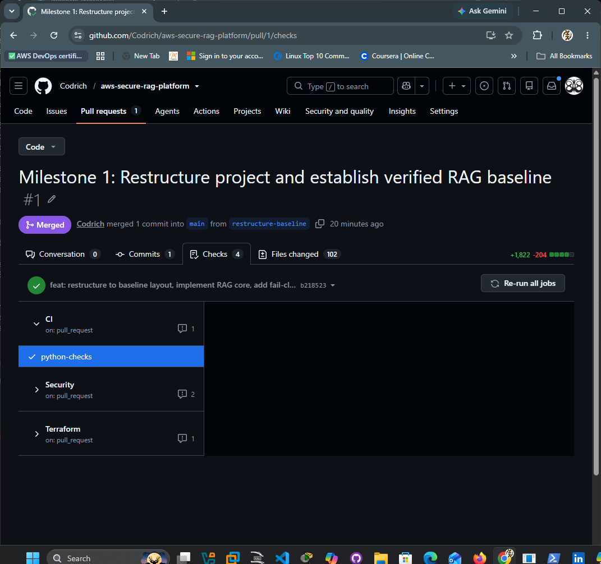
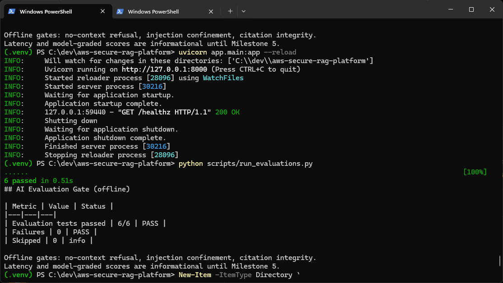

# AWS Secure RAG Platform

> Production-style, security-first Retrieval-Augmented Generation platform on AWS Bedrock — built with Terraform, ECS Fargate, FastAPI, and a DevSecOps pipeline with AI evaluation gates.

**Status: Phase 1 complete; local RAG core (retrieval, citations, ingestion) implemented.** See [Roadmap](#roadmap).

## Overview

A secure RAG platform where tenant isolation is enforced during retrieval, AI behavior is regression-tested in CI, failures default to safe behavior, and releases are blocked unless security, quality, and supply-chain gates pass. Built on Amazon Bedrock, FastAPI, pgvector, and Terraform, with governance documentation aligned to the NIST AI RMF and OWASP Top 10 for LLM Applications.

It is a platform-engineering and AI-security project, not a chatbot demo. All data is synthetic. Compliance mappings are alignment exercises, not certifications.

## Verified Milestone 1 Evidence

Milestone 1 establishes the verified secure RAG baseline:

- Python 3.11 CI validation
- Ruff and MyPy enforcement
- 27 passing application and evaluation tests
- 6/6 deterministic offline AI evaluation gates
- IaC, secret-scanning, and Terraform workflow checks
- working FastAPI health endpoint

### CI and Security Checks



### Offline AI Evaluation Gate



The offline evaluation gates verify no-context refusal, prompt-injection confinement, and citation integrity. Model-graded quality scores and latency thresholds remain deferred until live AWS deployment testing.

## Architecture (target)

```
User
  |
Amazon API Gateway  (WAF, rate limiting)
  |
Amazon Cognito  (OAuth 2.0 / JWT, RBAC)
  |
FastAPI RAG Service on ECS Fargate  (private subnets, no public IPs)
  |
  +-- Amazon Bedrock (configurable model ID) + Bedrock Guardrails
  +-- PostgreSQL + pgvector  (vector store, encrypted, private)
  +-- Amazon S3  (synthetic document store)
  +-- DynamoDB  (request metadata)
  +-- SQS  (ingestion jobs, DLQ)
  +-- KMS + Secrets Manager
  |
CloudWatch + CloudTrail  (redacted, structured logs; token/cost metrics)
```

### Architecture decision: pgvector vs. OpenSearch Serverless

v1 uses PostgreSQL with pgvector as the vector store. It demonstrates the same RAG capabilities (embeddings, similarity search, metadata filtering, private connectivity, encryption, backups) without the always-on OCU cost floor of OpenSearch Serverless. For larger-scale enterprise workloads — high ingest throughput, hybrid lexical+vector search, Bedrock Knowledge Base native integration — OpenSearch Serverless is the recommended alternative and is documented as such in `docs/architecture/`.

## Security posture (target)

- Least-privilege IAM scoped to specific model invocations
- Private subnets, VPC endpoints, no public IPs on tasks
- Bedrock Guardrails: prompt-attack detection, PII masking, contextual grounding
- Own prompt-injection test suite (Guardrails are not treated as complete protection)
- Redacted logging by default: no full prompts/responses outside labeled synthetic-data dev mode
- Signed container images (Cosign), SBOM (CycloneDX), IaC scanning (Checkov)
- Governance: `docs/governance/` — threat model, NIST AI RMF and OWASP LLM Top 10 mappings

## Quickstart (local development)

```bash
# Requires Docker and AWS credentials with bedrock:InvokeModel
cp .env.example .env   # set BEDROCK_MODEL_ID and AWS_REGION
make dev               # api + postgres/pgvector via docker-compose
make db-init           # create extension, table, HNSW index
make ingest            # embed and load the synthetic corpus
curl localhost:8000/healthz
curl -X POST localhost:8000/v1/query \
  -H 'Content-Type: application/json' \
  -d '{"question": "What is the document retention period?"}'
```

Run checks:

```bash
make lint   # ruff + mypy
make test   # pytest
```

## Repository structure

```
app/            FastAPI service: api/routes, rag core, clients, auth, core, models, tests
infrastructure/ Terraform modules (networking, ecs, rds, ...) and dev environment
evaluations/    Golden dataset, security cases, offline evaluation tests (CI gates)
policies/       Policy-as-code (OPA/Conftest), IAM least-privilege baselines
observability/  CloudWatch dashboard and alarm definitions
docs/           Architecture, governance, runbooks
scripts/        DB init, corpus ingestion, evaluation runner
synthetic-data/ Synthetic document corpus (no real data)
```

## Roadmap

| Milestone | Deliverable | Status |
|---|---|---|
| 1 | Make it work: restructure, packaging, lint/type/test green, one-command local run, cited RAG flow | Done (this branch) |
| 2 | Make it secure: tenant-aware retrieval, document classification, authorization + misuse-case tests | Done (identity resolver is a dev header shim until Cognito lands in M4) |
| 3 | Make AI behavior measurable: golden dataset, offline eval gates blocking CI, workflow scorecard | Done (offline); model-graded gates at M5 |
| 4 | Make the release trustworthy: Trivy, Gitleaks, SBOM, Cosign, provenance, evidence bundle | Partial: Checkov + secret scan in CI |
| 5 | Prove AWS delivery: Terraform foundation, ephemeral ECS deploy, smoke tests, teardown, cost report | Planned |
| 6 | Operational depth: SQS ingestion with DLQ, OpenTelemetry, red-team findings, demo recording | Planned |

Stretch goals: Bedrock Guardrails integration, Automated Reasoning policy validation.
Out of scope by decision: Backstage, Kubernetes variant, multi-cloud, SaaS control plane, always-on infrastructure.

## Known limitations

- All data is synthetic; compliance mappings are alignment exercises, not certifications.
- Offline evaluations are deterministic behavioral checks, not independent model-graded scores (those arrive with the ephemeral deployment).
- Tenant isolation is enforced at the retrieval query (tenant, classification and per-document role ACL) and independently by PostgreSQL row-level security. Caller identity currently comes from validated request headers; verified Cognito JWT claims replace that resolver in Milestone 4 without changing call sites.
- Row-level security is verified only in the CI `integration-tests` job, which runs a real pgvector container; those tests skip on machines without `TEST_DATABASE_URL`.
- pgvector is chosen for cost and reproducibility, not maximum-scale search.
- No cloud environment is kept running; AWS deployments are ephemeral by design.

## Governance documentation

- [Threat model](docs/governance/THREAT_MODEL.md)
- [NIST AI RMF mapping](docs/governance/NIST_AI_RMF_MAPPING.md)
- [OWASP LLM Top 10 mapping](docs/governance/OWASP_LLM_TOP_10_MAPPING.md)
- [AI incident response runbook](docs/runbooks/AI_INCIDENT_RESPONSE_RUNBOOK.md)
- [Failure-mode contract](docs/security/FAILURE_MODES.md)
- [Control traceability matrix](docs/security/CONTROL_TRACEABILITY.md)
- [Architecture decision records](docs/adr/)
- [Security policy](SECURITY.md)

## License

MIT
